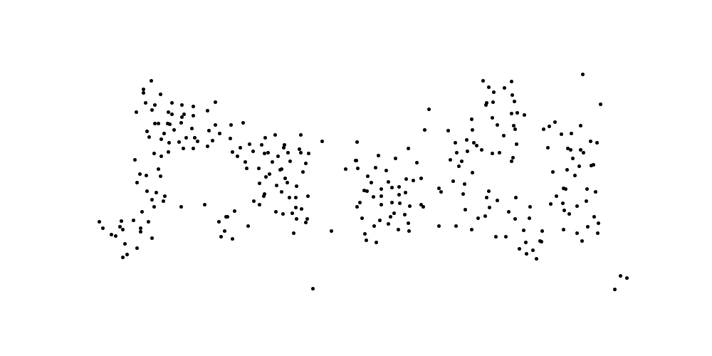
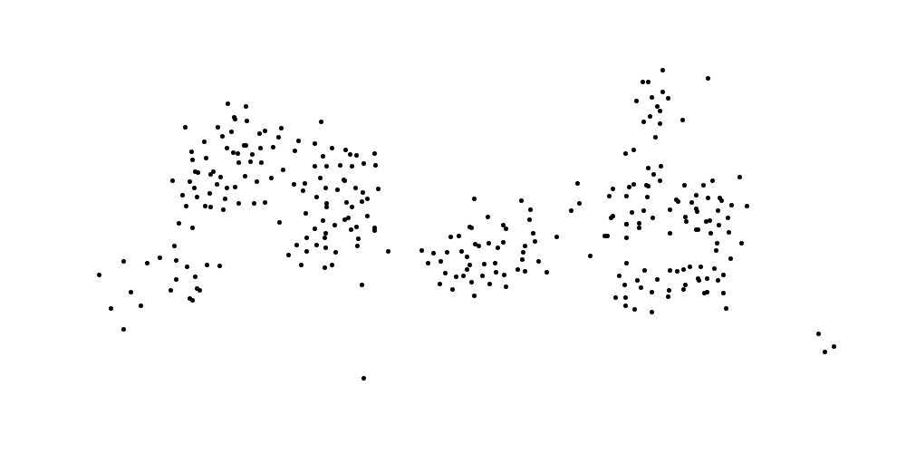
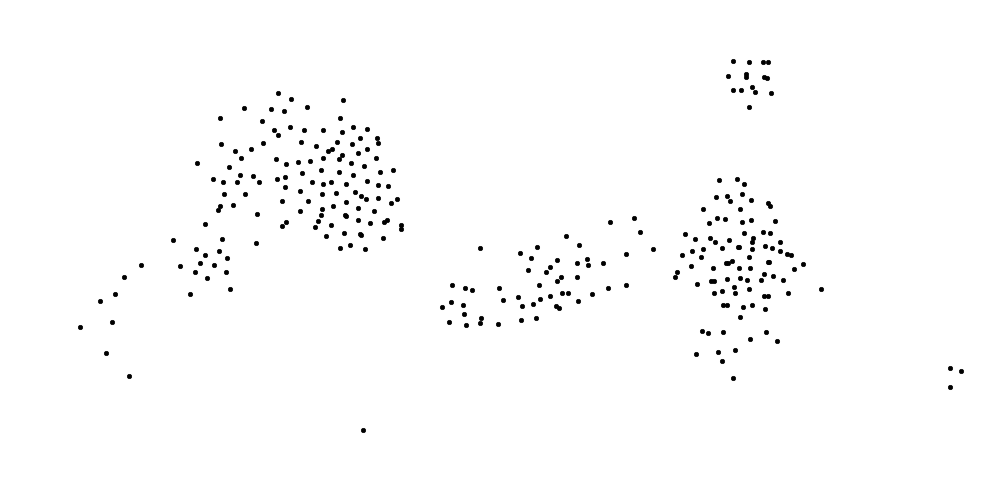

# BlockBoids
NumPy array based Boids simulation optimized with spatial tiling.

<p align="middle">
  
  
  
</p>

Above: example frames from one simulation with each of them 30 time step ahead
of the preceding one.

## Intro
The Boids model is used for simulating the flocking behavior of birds and the
name comes from the abbreviation of "bird-oid object" which refers to a
bird-like object. The model uses three simple movement rules: alignment,
cohesion and separation.

These rules compare boids positions and velocities with the other boids and
adjust the velocities based on the average differences. This is done inside a
sphere of given distance radius for each boid. We use separate variables for
the distances corresponding to each rule. Many sources use only two variables.
One for the alignment and cohesion and another one for the separation.

#### Optimizations
We use NumPy array based manipulations for computing each boid's position and
velocity updates. Also, instead of using all the other boids in these
computations, only the boids from the relevant rectangular areas are used. This
is done by dividing the position space into rectangular tiles which we ended up
naming to blocks. These blocks are squares whose side length is defined by

<p align="center">
  <i>
  length = max(alignment distance, cohesion distance, separation distance)
  </i>
<p>

(boundary facing blocks might have reduced size). For each boid only the boids
from the same block and from the blocks next to it in each direction are needed
for the updates.

## Installation
Clone this repository and install the libraries with pip:
```
git clone https://github.com/JussiM01/BlockBoids
cd BlockBoids/
pip install -r requirements.txt
```
We used Python 3.8 but the code probably works also with slightly earlier or
later versions. It was tested only with a computer that has Ubuntu as the
operating system. The animation is done with matplotlib and may need some
tweaks on other operating systems.

## How to use

### Basic use
For running the program with the default values use the following command:
```
python3 -m boids
```

### Changing the default values
The program uses command line arguments for changing the default parameter
values. Here only the main parameters and the ones which have slightly
non-trivial behavior are described.

Full list of the options and their descriptions along with the default values
can be printed out by using the help flag:
```
python3 -m boids -h
```

#### Model's main parameters
Number of boids is changed with the ```-nb``` option. The distances can be
changed with ```-ad```, ```-cd``` and ```-sd``` which stand for
alignment distance, cohesion distance and separation distance. The related
strength factors are controlled with the options ```-af```, ```-cf```
and ```-sf```. For example the command:
```
python3 -m boids -nb 100 -sd 40.0 -af 0.1
```
will run the simulation with 100 boids, using 40.0 separation distance and 0.1
alignment factor.

For computation time comparison purposes the use of blocks can be turned off.
This is done by using the no_blocks flag as follows:
```
python3 -m boids -no
```

#### Boundary behavior
There are two types of boundary behaviors available. These are avoid and wrap.
The first one which is the default choice turns the boids away from the canvas
boundaries when they get close enough to them. The second choice causes the
boids to reappear from the opposite side when they exit the canvas. For the
later behavior use the boundary_behavior flag as follows:
```
python3 -m boids -bb wrap
```

#### Random seed
For reproducibility purposes it is possible to use the random_seed flag as
follows:
```
python3 -m boids -r <seed>
```
where ```<seed>``` stands for the integer value for the random seed.

#### Profiling
The profiling option runs the simulation without the animation for the duration
of given amount of update steps. It is meant to be used with the cProfiler. For
running it with the default amount of update steps use:
```
python3 -m cProfile -m boids -p
```
The number of update steps can be changed with the num_steps flag as follows:
```
python3 -m cProfile -m boids -p -ns <number of steps>
```
where ```<number of steps>``` is the integer value for the amount of steps.

This functionality has been added mainly for the purpose of testing the
effectiveness of the block structure. Namely, one can run the profiling with
some number of boids and a random seed, for example 100 boids and 123 as
the value of the random seed:
```
python3 -m cProfile -m boids -nb 100 -r 123 -p
```
and then run the same command with the no_blocks flag added to it:
```
python3 -m cProfile -m boids -nb 100 -r 123 -p -no
```

## Computation time comparison
We run the profiling with a fixed random seed for a few different numbers of
boids with and without the use of blocks. Without the blocks the computation
time growth began to look quadratic whereas with them it was fairly linear.
The exact time values will of course depend on the used hardware.

<p align="middle">
  
</p>

## Closing thoughts
Without the blocks the model compares each boid with all the other boids which
explains the quadratic time growth. When the blocks are used the growth should
be roughly linear provided that the average count of boids within each boid's
relevant blocks stays close to a constant. If the size of the position space
is kept the same this will be violated at some point when the total number of
boids grows large enough.

The algorithm performs faster if the block size is reduced by making all the
distance parameters smaller. This however weakens the flocking effect and makes
it more likely that the boids are split into several smaller groups.

One thing that we did not optimize is the loop over all boids. We thought that
it would be interesting to do this with parallel processing on a GPU using
PyTorch tensors. This will be implemented in a separate project since the block
structure is not supported by the tensor based batch processing. Link to the
project will be added here when it's ready.

## Sources
General information about the Boids model is available in the corresponding
[Wikipedia article](https://en.wikipedia.org/wiki/Boids).
More details about the original model can be found from its inventor's
[Boids page](https://www.red3d.com/cwr/boids/). The idea for trying out the
block structure came to us from a research oriented
[blog post](https://adamprice.io/blog/boids.html). Before starting the project
we search the net for a good pseudocode presentation of the basic Boids
algorithm and found a very good one from a microcontroller course
[exercise page](https://people.ece.cornell.edu/land/courses/ece4760/labs/s2021/Boids/Boids.html).
